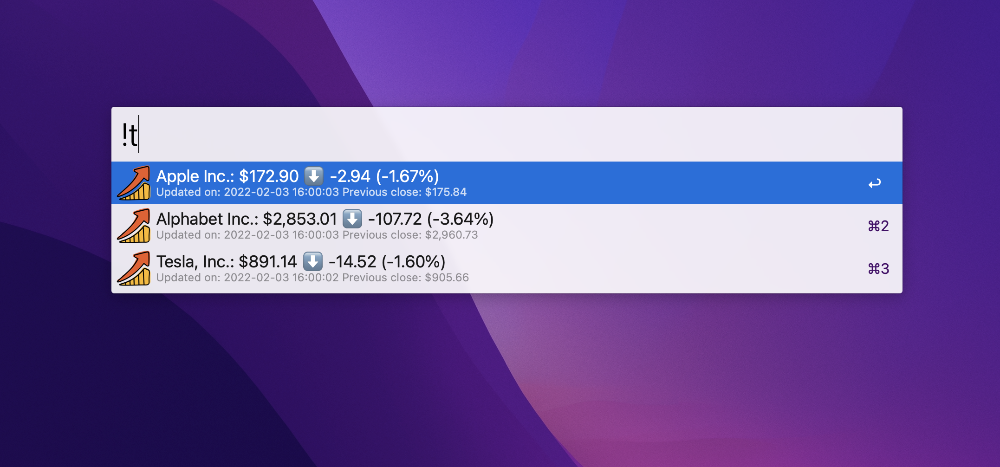
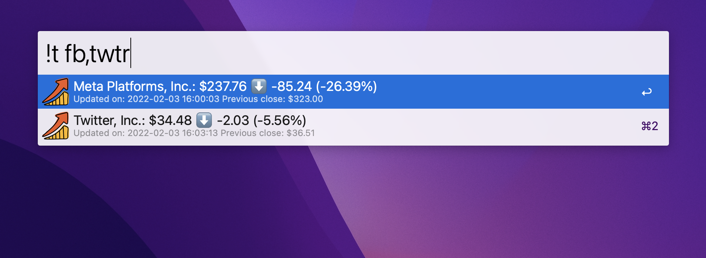

# alfred-ticker
 An [Alfred](https://www.alfredapp.com/) workflow to show stock information from [Yahoo Finance](https://finance.yahoo.com/) using an [unofficial API](https://rapidapi.com/apidojo/api/yh-finance/)

 
<a href="https://github.com/giovannicoppola/alfred-ticker/releases/latest/">
 
</a>

<!-- MarkdownTOC autolink="true" bracket="round" depth="3" autoanchor="true" -->

- [Setting up](#setting-up)
- [Basic Usage](#usage)
- [Acknowledgments](#acknowledgments)
- [Changelog](#changelog)
- [Feedback](#feedback)

<!-- /MarkdownTOC -->

<h1 id="setting-up">Setting up</h1>

### Needed

- Alfred with Powerpack license
- Python3 (howto [here](https://www.freecodecamp.org/news/python-version-on-mac-update/))
- API key (sign up for an API key [here](https://rapidapi.com/apidojo/api/yh-finance/). A free plan allows 500 requests/month) 
  

### Installation
1. Download the [most recent release](https://github.com/giovannicoppola/alfred-ticker/releases/latest) of `alfred-ticker` from Github and double-click to install
2. Get your API key
3. In Alfred, open the 'Configure Workflow and Variables' window in `alfred-ticker` preferences
					
	- set the `API_KEY` variable to the API key retrieved in Step 2
	- _Optional:_ set the emoji you want to show when the ticker is down (`SYMBOL_DOWN`, default: ⬇️) or up (`SYMBOL_UP`, default: ⬆️)
	- _Optional:_ set your watch list variable `WATCHLIST` (comma-separated list of ticker symbols)
4. _Optional:_ Setup a hotkey to launch alfred-ticker
5. _Optional:_ Change the keyword to launch alfred-ticker (currently set to `!t`)

<h1 id="usage">Basic Usage</h1>
Check your watchlist by typing your keyword or using your hotkey...

... or type stock symbols separated by comma

Pressing Enter will open the stock page on Yahoo Finance.

<h1 id="acknowledgments">Acknowledgments</h1>

- [Dean Jackson](https://github.com/deanishe) and [Vitor Galvão](https://github.com/vitorgalvao) for their incredible help on the Alfred mailing list. 
- Icon by [Iconka](http://www.iconka.com) from [icon-icons.com](https://icon-icons.com/icon/chart-growth-invest-market-stock/111188)

<h1 id="changelog">Changelog</h1>
- 11-30-2022: version 1.0 ready for Alfred 5
- 03-01-2022: version 0.2 removed `requests` dependency
- 02-04-2022: version 0.1

<h1 id="feedback">Feedback</h1>
Feedback welcome! If you notice a bug, or have ideas for new features, please feel free to get in touch either here, or on the [Alfred](https://www.alfredforum.com) forum. 

